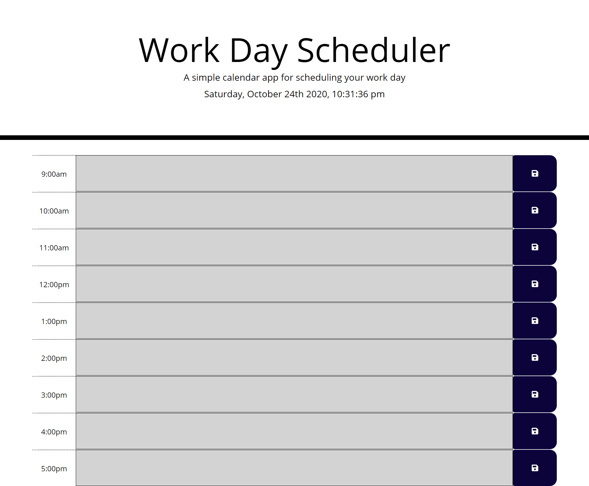

# 05HW-Work-Day-Scheduler
Homework 05 Third-Party APIs: Work Day Scheduler
used the started code provided for the base HTML and .CSS back worked the .css to add the elements to the HTML see Weblinks for addtional support 

# Page Links
link: https://git@github.com:JGilb28-7/05HW-Work-Day-Scheduler.git

# WebLinks used for support
https://www.w3schools.com/tags/tag_textarea.asp

https://www.w3schools.com/icons/tryit.asp?filename=tryicons_fa-save

https://www.sitepoint.com/managing-dates-times-using-moment-js/
moment().format('YYYY-MM-DD');

$(document.ready(function ()) {
moment('24/12/2019 09:15:00', "DD MM YYYY hh:mm:ss");
('#currentDay').date(moment().format("DD MM YYYY"))
moment().format('YYYY-MM-DD');
}

Local Storage - 
https://developer.mozilla.org/en-US/docs/Web/JavaScript/Reference/Global_Objects/JSON/parse
we got the object as a JSON string, and we need to parse it. We can parse
the JSON string by using JSON.parse and passing in the JSON string we want
to parse
var object = JSON.parse(objectJSONFromLocalStorage);

we could also do all of this on one line (getting the value from localStoragend parsing it)
var object = JSON.parse(localStorage.getItem("object-json"));

we use the setItem method which allows us to save data to local storage using
the provided key. The key is the first argument in the method call, and the
second argument is the data you want to save. NOTE that you can only store
strings in local storage.
localStorage.setItem("the_key", "a value");
